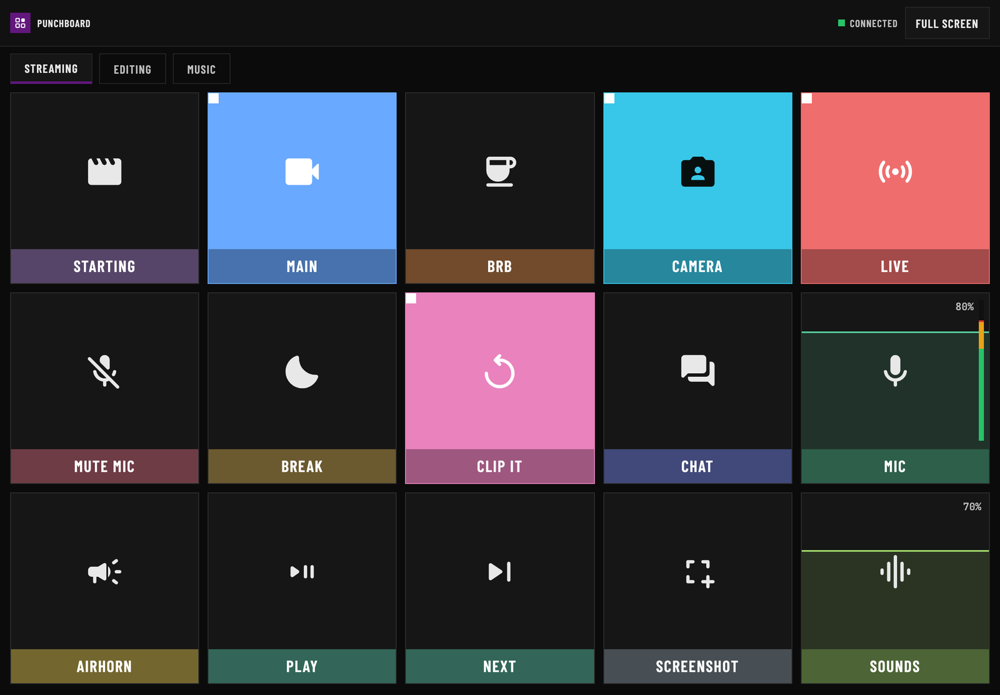
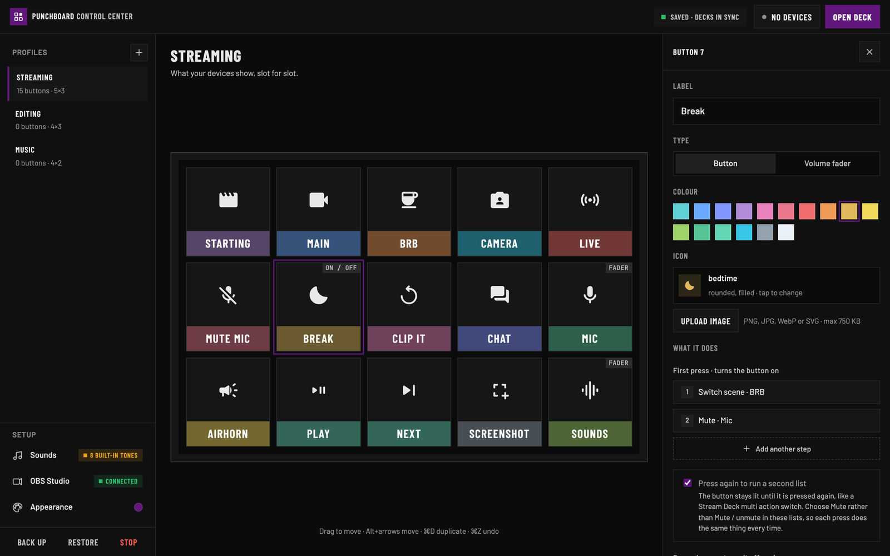
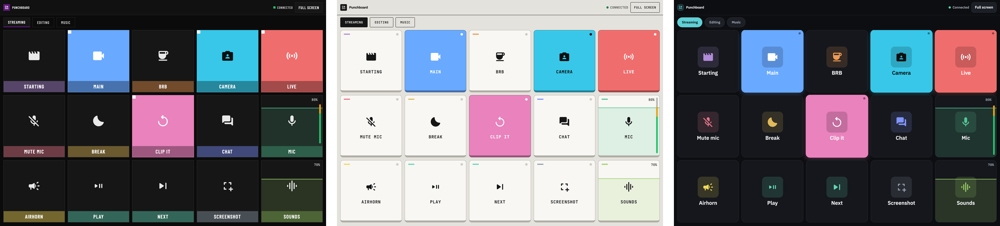

# Punchboard

[](https://ko-fi.com/hit_here)

Turn any tablet or phone into a macro pad for your computer: buttons and faders for shortcuts, apps, music, sounds and volume, with deep OBS support for streaming. Punchboard runs on your computer; your devices connect to it over the same wifi, in the browser. No account, no cloud, nothing to install on the tablet.

<p align="center"></p>

## Install

Download the latest version from **[Releases](https://github.com/GH-Jaider/punchboard/releases/latest)**:

- **Mac**: `Punchboard_…_apple-silicon.dmg` (M1 and newer) or `Punchboard_…_intel.dmg`. Open it and drag Punchboard to Applications.
- **Windows**: `Punchboard_…_windows-x64-setup.exe`.

Punchboard is not signed by Apple or Microsoft, so the first time you open it:

- **Mac**: macOS says it cannot check the app. Open **System Settings › Privacy & Security**, scroll down and click **Open Anyway**.
- **Windows**: click **More info › Run anyway**. If Windows Firewall asks, allow Punchboard on **private networks** so your devices can reach it.

After that it updates itself.

## First steps

1. **Pair a device.** In Punchboard, click **Pair a device** and scan the QR code with the tablet or phone. Keep both on the same wifi.
2. **Build your deck.** Click an empty slot to add a button, pick what it does, and it appears on your devices right away.
3. **Streaming? Connect OBS.** In OBS, open **Tools › WebSocket Server Settings** and tick **Enable WebSocket server**. Punchboard finds it by itself. Everything else works without OBS.

On an iPad, tap **Full screen** on the deck. On an iPhone, use **Share › Add to Home Screen** for a full-screen deck.

## What buttons can do

<p align="center"></p>

- **This computer**: press key combinations (any app's shortcuts), launch apps, open links, control music (play / pause, next, previous) and play sounds.
- **OBS**: switch scenes, show or hide sources, mute inputs, turn filters on or off, start or stop the stream, recording and virtual camera, save a replay, and send the preview live in Studio Mode. Buttons light up with what OBS is doing, even when you change it in OBS itself.
- **The deck**: go to another deck, or open a link on the device.
- **Faders**: the computer's volume, one app's volume, Punchboard's sounds, or an OBS input. On Windows any app that plays sound (Chrome, Spotify, Discord, a game); on a Mac, which has no per-app volume, Music and Spotify.
- **Trackpad decks**: set a deck's type to *Trackpad* and the whole screen works like a laptop trackpad: tap, drag, two-finger scroll with momentum, pinch to zoom, and three- and four-finger swipes for Mission Control, desktops and the desktop.
- **Macros**: several steps in a row, each with its own delay. A macro can also run a second list when pressed again, like a *Break* button that goes to BRB and mutes the mic, then comes back.

Three looks, for the Control Center and every device at once: **Broadcast**, **Hardware** and **Studio**, each with your own accent colour.

<p align="center"></p>

On a Mac, key combinations, music controls and the trackpad need a one-time permission: **System Settings › Privacy & Security › Accessibility**, allow Punchboard.

## Good to know

- Only paired devices can press buttons, and only this computer can edit decks. Remove a device in **Pair a device** to cut it off.
- Your decks, sounds and paired devices live in their own folder, so updates never touch them: `~/Library/Application Support/Punchboard` on Mac, `%APPDATA%\Punchboard` on Windows. **Back up** in the Control Center saves your decks (buttons, macros and layouts) to a file, and **Restore** brings them back; custom sounds, the theme and paired devices are not in it, so copy that folder to keep everything. Punchboard also keeps a daily copy of your decks in `decks/backups` inside it.
- **Lock the device to the deck**, so a swipe from the edge cannot leave it mid-stream: **Guided Access** on iPad and iPhone (Settings › Accessibility, then triple-click), **App pinning** on Android (Settings › Security). Full screen helps too.
- **Keep the device's screen on yourself**: a page on your local wifi cannot do it. On iPad and iPhone set **Settings › Display & Brightness › Auto-Lock** to Never; on Android set **Settings › Display › Screen timeout** (or *Sleep*) to the longest.

## For developers

Punchboard is strict TypeScript: `src/server` (the companion, run by Node 22.18+ directly), `src/client` (Control Center and deck, bundled by esbuild), `src/shared` (the model and API types both use). The desktop app is a small Tauri shell in `src-tauri` that carries its own Node.

```sh
npm install
npm run check     # type-check and build the pages
npm start         # run the companion from source (or start.command / start.bat)
npm test          # security and OBS tests, against a fake OBS
npm run app:dev   # the desktop app
```

The deck runs on old tablets too (Safari 11, ES2015): keep newer JavaScript and CSS out of `src/client/deck` and the shared code.

Pushing a tag like `v1.2.0` builds the Mac and Windows apps on GitHub Actions and drafts a release with them.

## Support

Punchboard is free. If it earns a place in your setup, you can buy its maker a coffee on **[Ko-fi](https://ko-fi.com/hit_here)**.

## License

[Apache License 2.0](LICENSE). Fonts under the SIL Open Font License; Google's Material Symbols under Apache 2.0.
